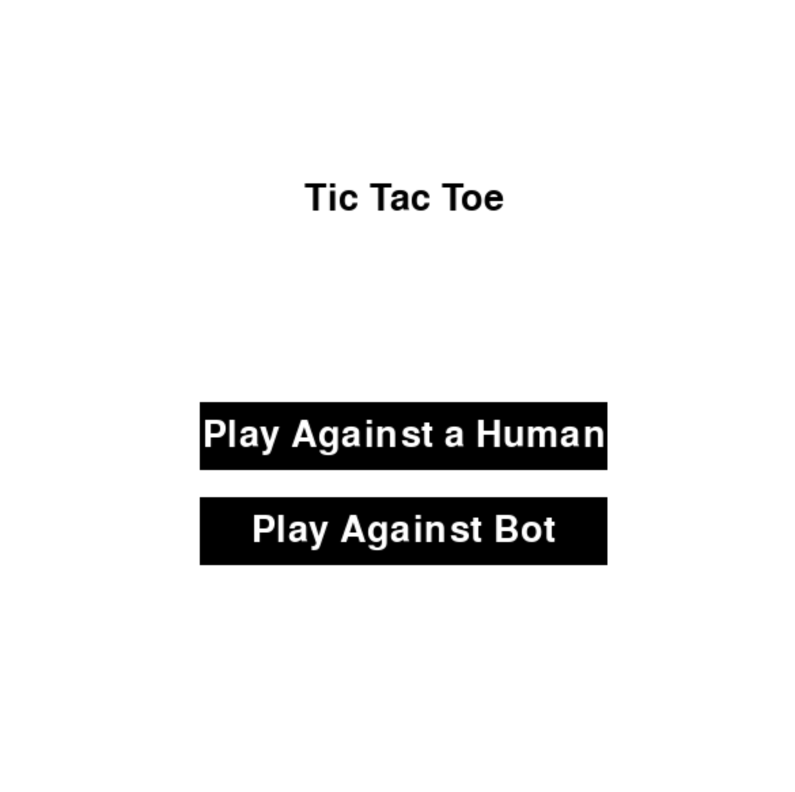
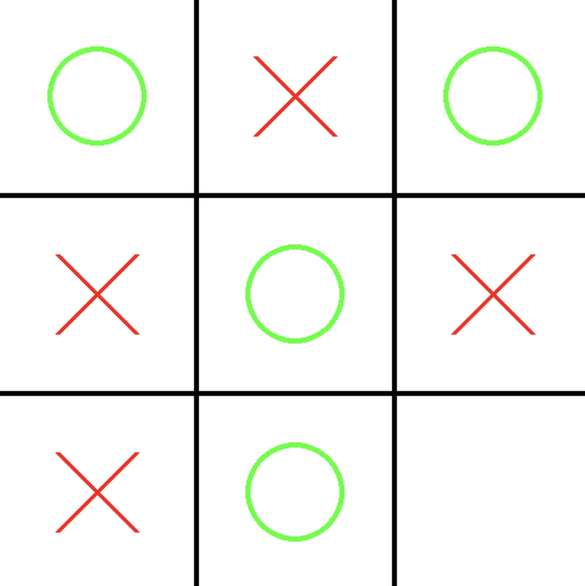

# PyGame TicTacToe

This is a simple implementation of the Tic Tac Toe game using Python and Pygame. It allows players to play against each other or against a bot.

## Features

- Start menu with options to play against another player or a bot.
- Displays the winner or a tie at the end of the game.
- Rematch option to play again.
- Uses Pygame for graphical user interface.

## Requirements

- Python 3.x
- Pygame

## Installation

1. Clone the repository:

   ```bash
   git clone https://github.com/your-username/tic-tac-toe.git
   
2. Change into the project directory:

    ```bash
    cd tic-tac-toe
    
3. Install the required dependencies:

    ```bash
    pip install -r requirements.txt

## Usage

Run the game by executing the following command:

    python tic_tac_toe.py


The game will launch with a start menu. Select the desired option to play against another player or a bot. After the game ends, a screen will be displayed indicating the winner or a tie. You can choose to rematch or return to the main screen.

## Screenshots






## Contributing

Contributions are welcome! If you find any issues or have suggestions for improvements, please feel free to open an issue or submit a pull request.

## License

This project is licensed under the MIT License. See the [LICENSE](LICENSE) file for details.


